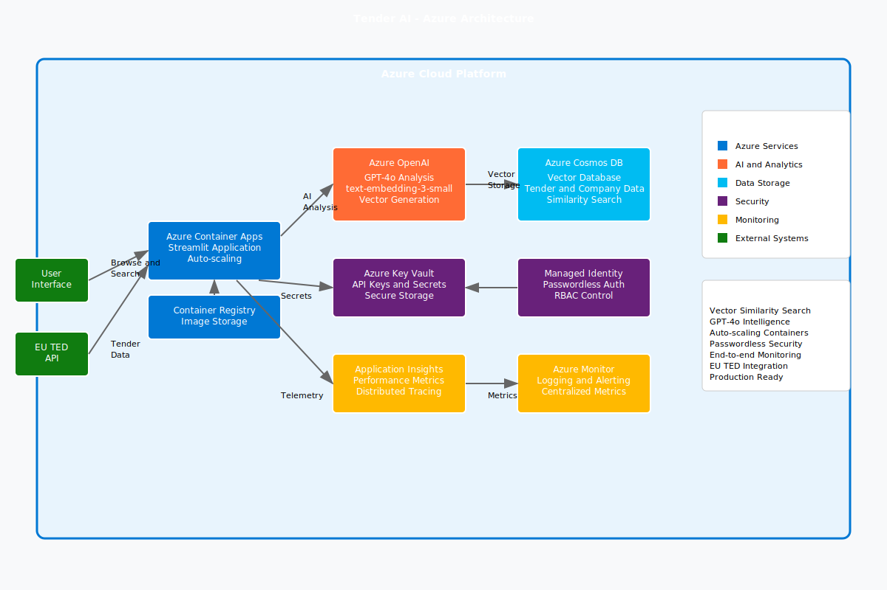

# 🎯 Tender AI - Secured by Azure

A production-ready AI-powered tender recommendation system built on Microsoft Azure, designed to match companies with relevant government tenders using advanced vector search and GPT-4 analysis.

## 👥 Authors

- **Sameer Ankalgi** - AI Engineer - MSFT
- **Hao Zhang** - AI Engineer - MSFT
- **Naya Giannakopoulou** - Lead Architect - MSFT_InnoLabs

## 🏗️ Azure Architecture



### Architecture Overview

The Tender AI application follows a modern, cloud-native architecture pattern leveraging Azure's AI and data services for intelligent tender matching:

```
┌─────────────────────────────────────────────────────────────────┐
│                        Azure Cloud Platform                     │
├─────────────────────────────────────────────────────────────────┤
│  ┌─────────────────┐    ┌─────────────────┐                     │
│  │ Azure Container │    │   Azure OpenAI  │                     │
│  │      Apps       │◄──►│   (GPT-4o +     │                     │
│  │   (Streamlit)   │    │  text-embed-3)  │                     │
│  └─────────────────┘    └─────────────────┘                     │
│           │                       │                             │
│           ▼                       ▼                             │
│  ┌─────────────────┐    ┌─────────────────┐                     │
│  │  Azure Cosmos   │    │   EU TED API    │                     │
│  │ DB (Vector DB)  │    │ (Tender Source) │                     │
│  └─────────────────┘    └─────────────────┘                     │
│           │                                                     │
│           ▼                                                     │
│  ┌─────────────────────────────────────────┐                   │
│  │          Support Services               │                   │
│  │  • Azure Key Vault (Secrets)           │                   │
│  │  • Azure Container Registry (Images)   │                   │
│  │  • Application Insights (Monitoring)   │                   │
│  │  • Azure Monitor (Logging)             │                   │
│  └─────────────────────────────────────────┘                   │
└─────────────────────────────────────────────────────────────────┘
```

### Core Azure Services

- **🚀 Azure Container Apps**: Serverless container hosting with auto-scaling
- **🧠 Azure OpenAI**: GPT-4o for intelligent analysis and text-embedding-3-small for vector embeddings
- **📊 Azure Cosmos DB**: Vector-enabled NoSQL database for tender and company data with similarity search
- **🔒 Azure Key Vault**: Secure secrets and API key management
- **📦 Azure Container Registry**: Secure container image storage and distribution
- **📈 Application Insights**: End-to-end observability and performance monitoring
- **📋 Azure Monitor**: Centralized logging, metrics, and alerting

## 🚀 Features

- **🔍 EU Tender Discovery**: Direct integration with official EU TED API for real-time tender data
- **🏢 Company Profile Management**: Structured company data with vector embeddings in Cosmos DB
- **💡 Intelligent Matching**: Vector similarity search powered by Azure OpenAI embeddings
- **📊 Production Monitoring**: Real-time metrics, distributed tracing, and performance insights
- **🔒 Enterprise Security**: Managed identities, RBAC, and Key Vault integration
- **⚡ Auto-scaling**: Container Apps with automatic resource optimization based on demand
- **🌍 Multi-region Support**: Deployable across Azure regions with geo-redundancy options

## 📋 Prerequisites

- **Azure CLI** (`az`) version 2.60+
- **Azure Developer CLI** (`azd`) version 1.16+
- **Docker** (optional - Azure can build images in the cloud)
- **Azure subscription** with appropriate permissions for:
  - Resource group creation
  - Azure OpenAI service deployment
  - Cosmos DB provisioning
  - Container Apps environment setup

## 🛠️ Quick Start

### 1. Clone and Initialize

```bash
git clone https://github.com/heisenberg-alt/tender-engine.git
cd tender-engine
azd init
```

### 2. Configure Environment Variables

Copy the environment template and fill in your Azure credentials:

```bash
cp .env.example .env
```

Edit `.env` with your Azure configuration:

```bash
# Azure Configuration
AZURE_OPENAI_ENDPOINT=https://your-openai-resource.openai.azure.com/
AZURE_OPENAI_API_KEY=your_azure_openai_key
AZURE_OPENAI_DEPLOYMENT_NAME=gpt-4o
AZURE_OPENAI_EMBEDDING_DEPLOYMENT_NAME=text-embedding-3-small

# Cosmos DB Configuration  
COSMOS_DB_ENDPOINT=https://your-cosmos-account.documents.azure.com:443/
COSMOS_DB_KEY=your_cosmos_db_key
COSMOS_DB_DATABASE_NAME=tender-recommender

# EU TED API (provided for development)
EU_TED_API_KEY=your_eu_ted_api_key_here
```

### 3. Deploy to Azure

```bash
azd up
```

This command will:
- 🏗️ Create all Azure resources using Bicep templates
- 📦 Build and deploy the container image to Azure Container Registry
- ⚙️ Configure environment variables and secrets in Key Vault
- 📊 Set up monitoring and logging with Application Insights
- 🚀 Deploy the application to Azure Container Apps

### 4. Configure Deployment

During deployment, you'll be prompted for:
- **Environment Name**: Unique identifier for your deployment (e.g., `tender-prod`)
- **Azure Region**: Choose your preferred region (e.g., `eastus`, `westeurope`)
- **Azure Subscription**: Select your target subscription

## 🏗️ Infrastructure as Code

The infrastructure is defined using Bicep templates in the `infra/` directory:

```
infra/
├── main.bicep              # Main orchestration template
├── resources.bicep         # Azure resources definitions
└── main.parameters.json    # Environment-specific parameters
```

### Key Infrastructure Features

- **🔍 Vector Search**: Cosmos DB configured with vector indexing for similarity search
- **🔒 Security**: Managed identities, Key Vault integration, and RBAC permissions
- **📊 Observability**: Application Insights with automatic instrumentation and custom metrics
- **🌐 Networking**: Container Apps with CORS configuration and health checks
- **📈 Scalability**: Auto-scaling based on CPU, memory, and HTTP request metrics
- **🏷️ Resource Tagging**: Consistent tagging for cost management and governance

## 📁 Project Structure

```
tender-engine/
├── app.py                      # Streamlit application entrypoint
├── azure.yaml                  # Azure Developer CLI configuration
├── Dockerfile                  # Container image definition
├── requirements.txt            # Python dependencies (Azure-focused)
├── .env.example               # Environment variables template
├── agents/
│   ├── company_agent.py       # Company profile management
│   └── tender_agent.py        # EU TED API integration & tender processing
├── llm/
│   └── azure_recommender_llm.py # Azure OpenAI integration
├── utils/
│   ├── config.py              # Configuration management
│   └── tender_crawler.py      # EU TED API crawler with Swiss support
├── vectorstore/
│   └── cosmos_vector_store.py # Azure Cosmos DB vector operations
├── infra/                     # Bicep infrastructure templates
│   ├── main.bicep
│   ├── resources.bicep
│   └── main.parameters.json
└── data/
    └── raw_tenders/           # Local tender data storage
```

## 🧠 How It Works

### 1. EU Tender Data Ingestion

- **Direct API Integration**: Connects to official EU TED API for real-time tender data
- **Structured Processing**: Extracts and normalizes tender information (title, description, CPV codes, deadlines)
- **Vector Embedding**: Uses Azure OpenAI text-embedding-3-small to create semantic embeddings
- **Cosmos DB Storage**: Stores tender data with vector indexes for similarity search

### 2. Company Profile Management

- **Profile Creation**: Companies input expertise areas, certifications, and capabilities
- **Semantic Analysis**: Azure OpenAI analyzes company descriptions and generates embeddings
- **Vector Storage**: Company profiles stored in Cosmos DB with searchable vector representations

### 3. Intelligent Matching

```python
# Vector similarity search with Azure OpenAI
embeddings = azure_openai.get_embeddings(company_profile)
similar_tenders = cosmos_db.vector_search(embeddings, similarity_threshold=0.7)

# GPT-4o analysis for detailed recommendations
recommendation = gpt4o.analyze_match(company_profile, tender_data)
```

### 4. Real-time Recommendations

- **Vector Similarity**: Fast similarity search using Cosmos DB vector indexes
- **AI Analysis**: GPT-4o provides detailed match reasoning and recommendations
- **Scoring System**: Multi-factor scoring based on expertise, location, company size, and past performance

## 🖥️ Local Development

### Run Locally with Docker

```bash
# Build the container
docker build -t tender-engine .

# Run with environment variables
docker run -p 8501:8501 --env-file .env tender-engine
```

### Run with Python

```bash
# Install dependencies
pip install -r requirements.txt

# Run the Streamlit app
streamlit run app.py
```

The application will be available at `http://localhost:8501`

## 📊 Monitoring and Observability

### Application Insights Integration

- **📈 Custom Metrics**: Track tender matches, API response times, and user interactions
- **🔍 Distributed Tracing**: End-to-end request tracking across Azure services
- **⚠️ Error Monitoring**: Automatic error detection and alerting
- **📊 Performance Analytics**: Real-time performance dashboards

### Key Metrics Tracked

- Tender processing rate
- Company profile creation frequency  
- Vector search performance
- OpenAI API usage and costs
- Container resource utilization

## 🔒 Security Features

- **� Managed Identity**: Passwordless authentication between Azure services
- **�️ Key Vault Integration**: Secure storage of API keys and connection strings
- **🛡️ RBAC Permissions**: Least-privilege access control
- **🔒 Network Security**: Private endpoints and secure communication
- **📋 Compliance**: GDPR-compliant data handling and retention policies

## 🌍 Deployment Environments

- **Development**: `azd env new dev` - Single-region, cost-optimized
- **Staging**: `azd env new staging` - Production-like with reduced capacity
- **Production**: `azd env new prod` - Multi-region, high-availability setup

## 🤝 Contributing

We welcome contributions! Please:

1. Fork the repository
2. Create a feature branch (`git checkout -b feature/amazing-feature`)
3. Commit your changes (`git commit -m 'Add amazing feature'`)
4. Push to the branch (`git push origin feature/amazing-feature`)
5. Open a Pull Request

## 📄 License

This project is licensed under the MIT License - see the [LICENSE](LICENSE) file for details.

## 🙋‍♂️ Support

For questions or support:
- 📧 Create an issue in this repository
- 📝 Check the [ENV_SETUP.md](ENV_SETUP.md) for configuration help
- 📖 Review the [EU_TED_INTEGRATION_SUMMARY.md](EU_TED_INTEGRATION_SUMMARY.md) for API details

